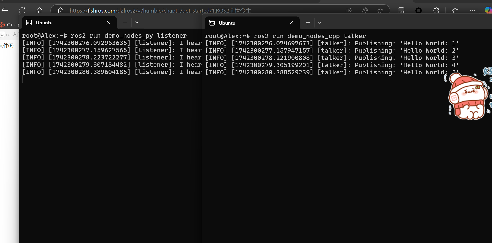

# Robotics Intro

> Note Taking: Alex
>
> Reference: `https://fishros.com/d2lros2/#/humble/` 小鱼**ros**教程

## ROS2

#### 说在前面的话

可以一键安装很多软件：

```bash
wget http://fishros.com/install -O fishros && . fishros
```

一路按照说明进行安装，我们这里的版本是`ros2/humble`

笔者踩了许多坑，在这里总结入门ros2的最简单方法。

安装好了ros2后，开机启动

```bash
source ~/.bashrc
```

`Helloworld`程序：打开两个`Ubuntu`终端，分别输入：

```bash
ros2 run demo_nodes_py listener
```

```bash
ros2 run demo_nodes_cpp talker
```

可以看到如下的两个终端的`talker`和`listener`的内容



传统的机器人学中，机器人分为**感知，决策，控制**三部分。Ros系统的基本组成是Node，Node之间通过通信协议完成机器人的功能。


