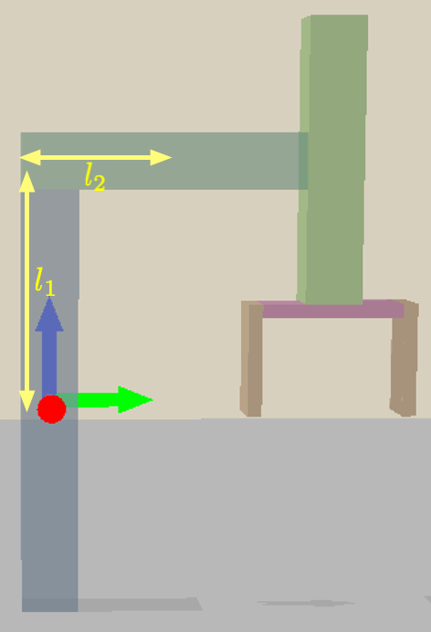
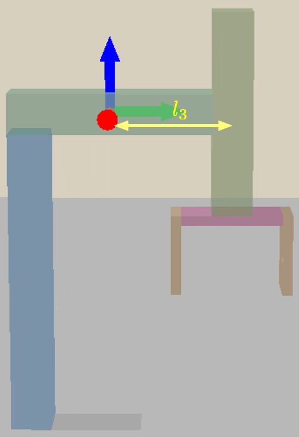
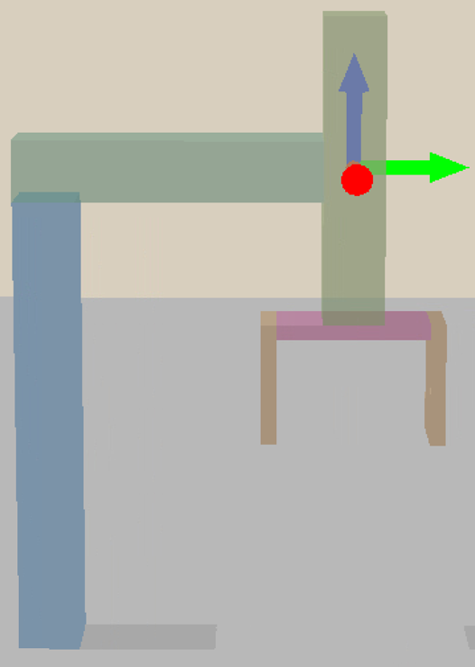
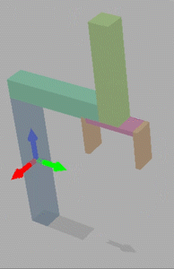
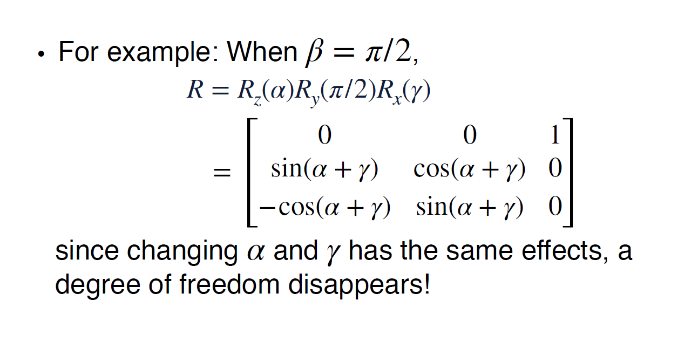
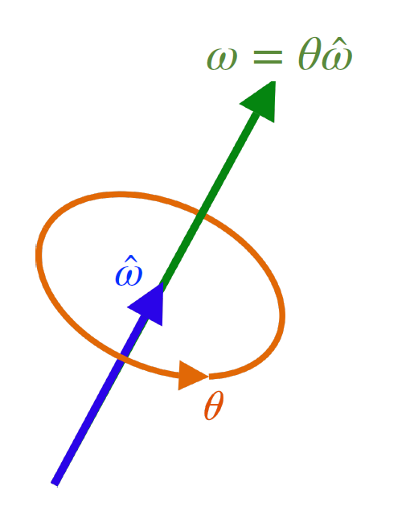
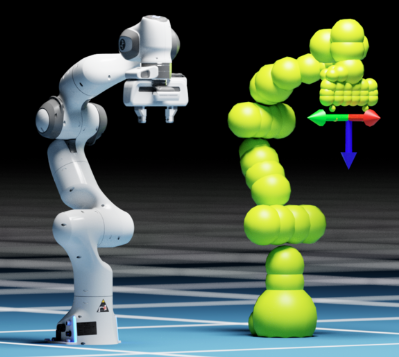
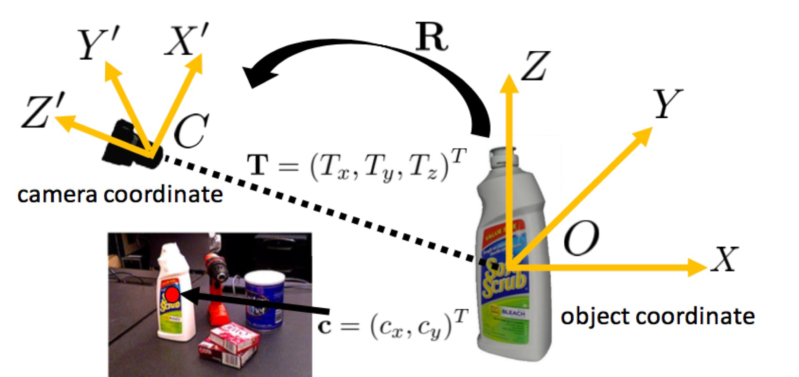
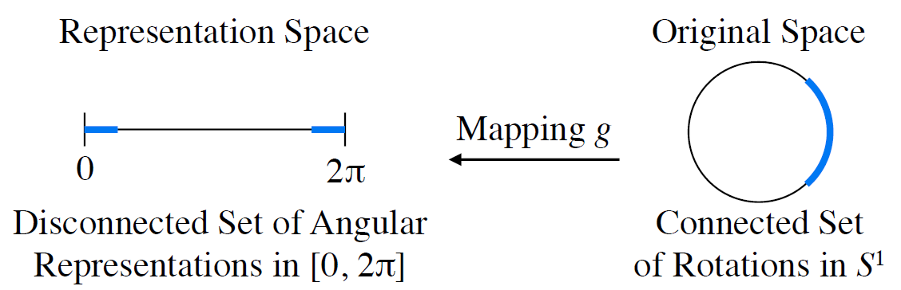
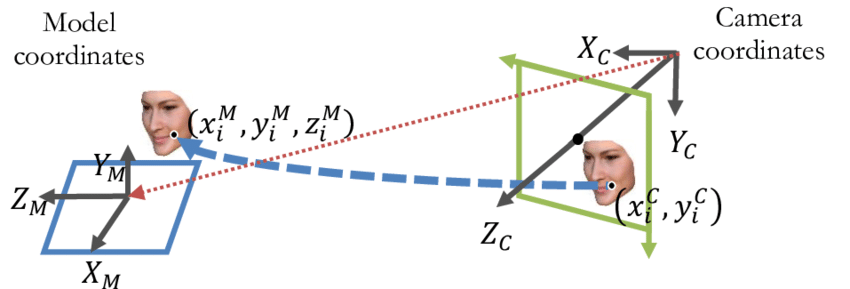

# Introduction to Embodied AI

- These notes were compiled from a course on Embodied AI audited at Peking University. The course homepage is available [here](https://pku-epic.github.io/Intro2EAI_2025/).

> Notes by: Zixuan Wang
> 
> Email: `wang-zx23@mails.tsinghua.edu.cn`
> 
> Instructor: `He Wang`

[TOC]

## Kinematics

### Rigid Transformation

> Describing the motion of bodies (position and velocity). Kinematics does not consider the forces that cause motion.

**DoF**: Degree of Freedom

A **Rigid Transformation** is described by the pair $(R_{s \rightarrow b}, \mathbf{t}_{s \rightarrow b})$, representing rotation and translation.

As shown in the figure, we use $\mathcal{F}_{s}$ to denote the source coordinate frame and $\mathcal{F}_{b}$ for the body frame. The relationship is:

$$ 
o_b^s = o_s^s + \mathbf{t}_{s \rightarrow b }^s\\ 
[x_b^s,\cdots] = R_{s \rightarrow b}^s[x_s^s, \cdots] 
$$

The coordinate transformation from frame $b$ to frame $s$ is given by:
$p^s = R^s_{s \rightarrow b}p^b + \mathbf{t}^s_{s \rightarrow b}$

This transformation is non-linear:
$$ 
p_1^s + p_2^s \neq R_{s\rightarrow b}^s(p_1^b + p_2^b) + t_{s\rightarrow b}^s \quad \text{when} \quad  t_{s\rightarrow b}^s \neq \mathbf{0}
$$

For efficient computation, especially with hardware acceleration, we prefer a linear representation using matrices.

**Homogeneous Coordinates**
A point $p = [x, y, z]^T$ is represented as $\hat{p} = [x, y, z, 1]^T \in \mathbb{R}^4$.

**Homogeneous Transformation Matrix**
$$ 
T^s_{s \rightarrow b} = \begin{bmatrix} 
R^s_{s \rightarrow b} & \mathbf{t}_{s \rightarrow b }^s \\ 
\mathbf{0}^T &  1\ 
\end{bmatrix} 
$$

This allows us to write the coordinate transformation in a linear form:
$$ 
\hat{p}^s = T^s_{s \rightarrow b} \hat{p}^b 
$$

As a general notation for transforming from frame 2 to frame 1:
$$ 
\hat{p}^1 = T^1_{1 \rightarrow 2} \hat{p}^2 
$$

The inverse transformation from frame 1 to frame 2 is simply the matrix inverse:
$$ 
T^2_{2 \rightarrow 1} = (T^1_{1 \rightarrow 2})^{-1} 
$$

### Multi-Link Rigid-Body Geometry

> **Terms:**
> - **Links** are the rigid bodies connected in sequence.
> - **Joints** are the connectors between links, determining the Degrees of Freedom (DoF) of motion.

| Base                                           | Link 1                                         | Link 2                                         | End-Effector                                                 |
| ---------------------------------------------- | ---------------------------------------------- | ---------------------------------------------- | ------------------------------------------------------------ |
|  |  |  |  |

<!-- Note: The following image link uses an absolute Windows path and will be broken. -->

### Kinematics: Two Primary Spaces

- **Joint Space (Configuration Space)**
  > The space where each coordinate corresponds to a joint value (e.g., angle or displacement).

- **Cartesian Space (Task Space)**
  > The space describing the position and orientation of the end-effector.

| Aspect           | Joint Space                                                  | Cartesian Space                                              |
| ---------------- | ------------------------------------------------------------ | ------------------------------------------------------------ |
| **Definition**   | Describes robot configuration in terms of joint variables.   | Describes the end-effector's pose in physical space.         |
| **Representation** | A vector of joint angles or displacements (e.g., $[q_1, q_2, q_3]$). | A position vector and a rotation matrix (e.g., $[x, y, z]$ and $R$). |
| **Space Type**   | Abstract, does not directly map to physical space.           | Represents the physical 3D space where the robot operates.   |
| **Control**      | Used for direct control of individual joints.                | Used for controlling the end-effector's goal pose.           |

- **Forward Kinematics (FK)**
> Maps joint space coordinates $\theta \in \mathbb{R}^n$ to an end-effector pose $T_{s \rightarrow e}$:
> $$ T_{s \rightarrow e} = f(\theta) $$
> This is solved by composing transformations along the kinematic chain.

- **Inverse Kinematics (IK)**
> Given a target pose $T_{\text{target}}$, find the joint coordinates $\theta$ such that $T_{s \rightarrow e}(\theta) = T_{\text{target}}$.

**IK Solutions:**
- **Analytical solutions** exist for simple cases but are rare.
- **Numerical methods** are common, typically using iterative optimization (e.g., gradient descent) to minimize an error function like $\text{argmin} \|T(\theta) - T_{\text{target}}\|_F^2$.

Modern robotic arms often have 6 or 7 DoF. The extra degree of freedom in a 7-DoF arm helps avoid singularities and provides more flexibility.

**Challenges**: IK may have no solution (target out of reach) or multiple solutions. Singularities (loss of a DoF) are also a key issue. Redundant joints can help mitigate this.

**Learning-based approach (e.g., VLA)**: Instead of solving IK analytically, a model can be trained to predict the change in joint angles $\Delta \theta$ required to achieve a desired change in end-effector pose $(\Delta R, \Delta t)$.

## Rotation

$$ 
\mathbb{SO}(3) = \{R \in \mathbb{R}^{3 \times 3} : R R^T = I, \det(R) = 1 \} 
$$

Rotation preserves the "handedness" (chirality) of an object, hence $\det(R) = +1$.

**Issues with Rotation Matrix Representation**:
- A 3-DoF rotation is represented by 9 values, which is redundant.
- Numerical drift can cause the matrix to become non-orthogonal. It must be re-normalized, for which SVD is a robust method.

### Euler Angles
- e.g., **Roll-Yaw-Pitch**. The order of rotations is crucial as they are not commutative.
- **Gimbal Lock**: A major issue where one degree of freedom is lost.

### Axis-Angle Representation
- Represents a rotation by an axis (a unit vector $\mathbf{u}$) and an angle $\theta$.
- More compact (4 numbers, but 3 DoF due to unit vector constraint).

### Quaternions
- A 4D representation $(x, y, z, w)$ that avoids gimbal lock and is computationally efficient for composition and interpolation.
- Widely used in robotics (ROS) and physics engines (PhysX, PyBullet).

### Interpolation

In motion planning, we need to smoothly interpolate between two rotations, $R_1$ and $R_2$. Linear interpolation of matrices is invalid.

- **Approach 1 (Axis-Angle)**: Convert rotations to axis-angle, interpolate the angle, and convert back. This is complex.
- **Approach 2 (Quaternion)**: Use **SLERP** (Spherical Linear Interpolation) to interpolate quaternions along the geodesic on the 4D hypersphere. This is the standard and preferred method.

### Rotation Representations in Neural Networks

- **Challenge**: Euler angles, axis-angle, and quaternions have discontinuities. A small change in orientation can cause a large jump in the representation (e.g., angle wrapping around from $\pi$ to $-\pi$).
- **Problem**: Neural networks are continuous function approximators and struggle to learn these discontinuities.
- **Solution**: Using a continuous representation, like a 6D representation (the first two columns of the rotation matrix), is often more stable for training. The third column can be recovered via the cross product. The loss is then calculated on the full rotation matrix, e.g., $L = \|R_{\text{pred}} - R_{\text{gt}}\|_F^2$.

## Motion Planning

> **Goal**: Find a valid trajectory (a sequence of configurations) from a start state $q_{\text{start}}$ to a goal state $q_{\text{goal}}$ while avoiding collisions.

<!-- Note: The following image link uses an absolute Windows path and will be broken. -->

- The configuration space (`qpos` = $(\theta_1, \theta_2, \dots)$) is often high-dimensional, leading to the **curse of dimensionality** for search algorithms.

### Collision Modeling

How to represent a robot's geometry for collision checking:
1.  **Vision Mesh**: High-resolution mesh for rendering.
2.  **Collision Mesh**: A simplified, often convex-decomposed, mesh for efficient physics calculations. A common simplification is to use a set of primitive shapes like spheres or capsules to bound the geometry.

## Grasping

#### Definition

> Grasping is the process of restraining an object’s motion in a desired way by applying forces and torques at a set of contacts.

- **Grasp Synthesis**: A high-dimensional search or optimization problem to find a valid gripper configuration to securely hold an object.

#### Terminology

- **Grasp Pose**: The 6-DoF position and orientation of the gripper.
- **Top-down Grasp**: A simplified 4-DoF grasp (x, y, z, yaw) often used in tabletop manipulation.
- **Gripper DoFs**: A parallel gripper has 1 DoF (width), while a dexterous hand can have 20+ DoFs.

### Open-Loop Grasping

This approach predicts a grasp pose without real-time feedback during execution.

**Two Main Paths:**
1.  **Known Objects**: First, perform 6D pose estimation of the object, then use its known geometry to plan a grasp.
2.  **Unknown/General Objects**: Directly predict a good grasp pose from sensor data (e.g., RGB-D image).

#### 6D Object Pose Estimation

For a known, asymmetric object, its 6D pose can be uniquely determined from a single RGB image if the camera intrinsics are known.

#### Rotation Regression in Grasping

As with motion planning, predicting rotation for a grasp pose is challenging for neural networks due to the discontinuity of Euler angles and other representations.

### Point Cloud Alignment

#### Orthogonal Procrustes Problem

This is a classic problem that solves how to find the optimal rotation and translation to align one set of corresponding points to another, minimizing the sum of squared distances. It has a closed-form solution using SVD.

This is fundamental for tasks like aligning a sensed point cloud of an object to its canonical 3D model.

This is used to generate a direct supervision signal for training pose estimation networks.

### Orthogonal Procrustes Problem

Solves the problem of aligning one set of points to another by finding the optimal rigid transformation (rotation, translation, and optionally scale).

Given two sets of corresponding points, $P$ and $Q$, it finds a rotation $R$ that minimizes $\|RP - Q\|_F^2$. The solution is found via SVD of the covariance matrix $H = P Q^T$.