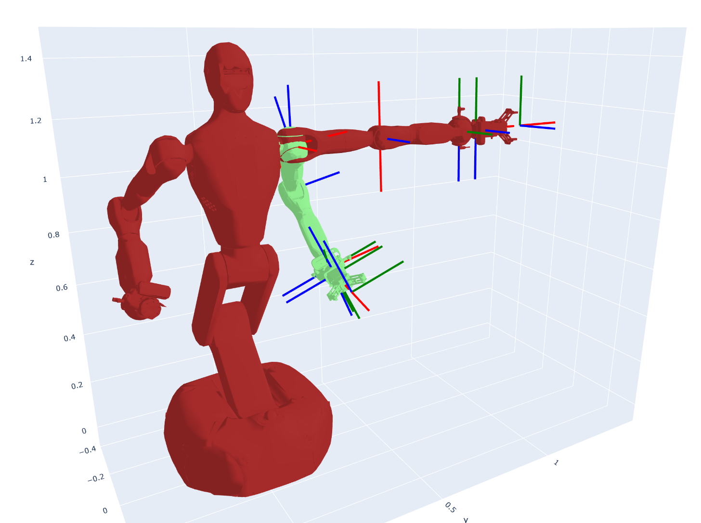

# Assignment 1

In this assignment, you are required to finish two tasks:

1. Rotation functions: You will implement the functions in ```rotation.py``` using numpy.
2. Forward kinematics: Given the galbot urdf at ```galbot/galbot_left_arm_simple.urdf```, you need to compute the translation and rotation of all robot links.

## Envirionment

You can install the environment as follows:
```sh
conda create -n hw1 python=3.10
conda activate hw1
pip install -r requirements.txt
```

## Rotation Functions (66%)

You are required to implement those functions in ```rotation.py``` using numpy: 

1. quat_normalize
2. quat_conjugate
3. quat_multiply
4. quat_rotate
5. quat_relative_angle
6. interpolate_quat
7. quat_to_mat
8. mat_to_quat
9. quat_to_axis_angle
10. axis_angle_to_quat
11. uniform_random_quat

We use wxyz order in quaternions, and you can assume all quaternion inputs are already normalized except ```quat_normalize```.

If there are multiple correct answers, you can output any except if the comment of that function restricts the output.

You will get 6% score for each function.

## Forward Kinematics (34%)

You are required to finish the function ```RobotModel.fk``` in ```robot_model.py```.

We have already written a simple URDF parser for you, which can transform the URDF file into a set of ```Link```s and ```Joint```s. You can see their definition in ```urdf_types.py```.

We also provide a simple visualization code in ```vis.py``` based on plotly, which supports interactive visualization. You can visualize the galbot robot with ```RobotModel.vis``` with link poses as input. It will plot the robot mesh and the pose of each link. For each pose the red, green, and blue vectors represents the X, Y, and Z axes respectively.

You can compare the ground truth fk result with your result by running ```python robot_model.py```, it should look like this:

You will get 34% score for this function.



## Testing & Uploading

You can run ```pytest``` to test it with example data. Your code is correct if it shows ```12 passed```.

You can upload your code by running ```pack.py``` to generate a .zip file which only contains ```rotation.py``` and ```robot_model.py``` and upload it in ```course.pku.edu.cn```. 
All modification in other files is ignored.

For example, if your id is 2000010000 and your name is Zhang San, then you can use  ```python pack.py --id 2000010000 --name ZhangSan``` to upload.
