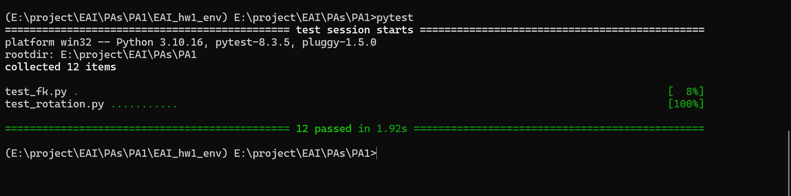
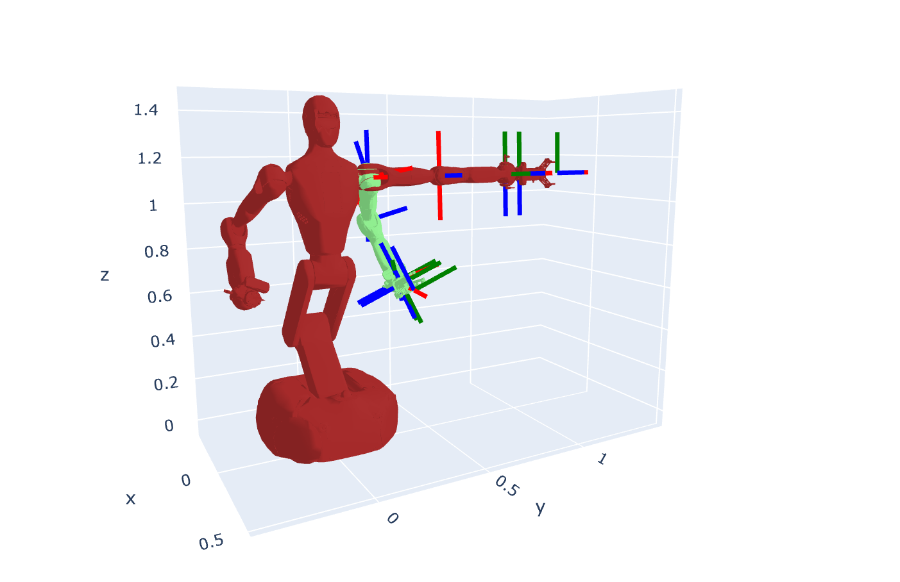
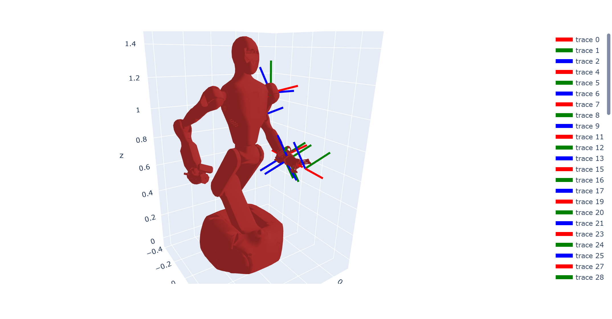

# Assignment 1
>姓名：王子轩
>邮箱：`wang-zx23@mails.tsinghua.edu.cn`
## My Result
```bash
conda create -n hw1 python=3.10 
conda activate hw1 
pip install -r requirements.txt
```
```bash
pytest
```

```python
python robot_model.py
```

Here are my results:


| ---                         | ---                    |
| --------------------------- | ---------------------- |
|  |  |

|