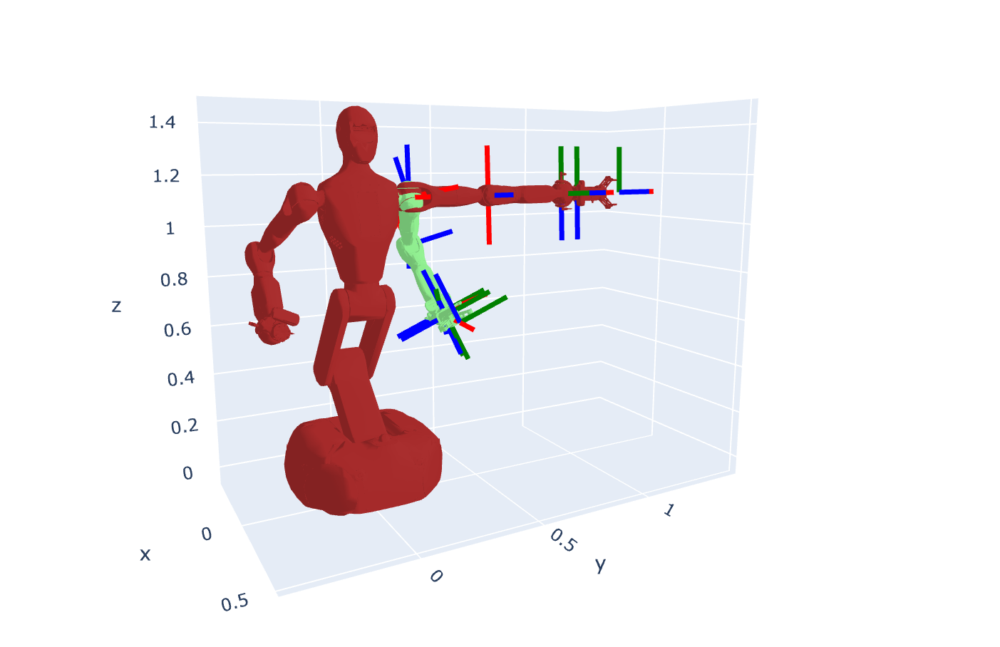
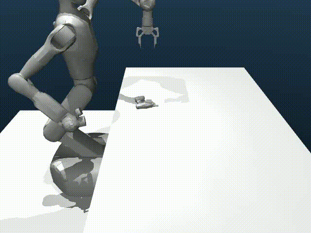
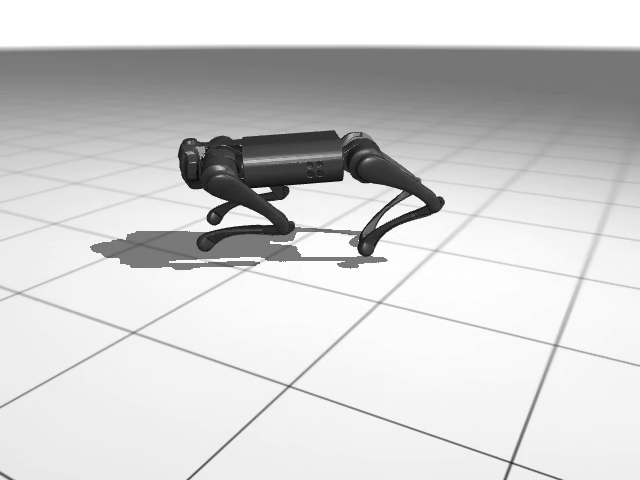

# Introduction to Embodied AI

**Instructor:** He Wang

**Course Website:** [https://pku-epic.github.io/Intro2EAI_2025/](https://pku-epic.github.io/Intro2EAI_2025/)

## Course Overview

This course introduces fundamental concepts and practical applications in Embodied AI, covering robotics fundamentals, computer vision, and reinforcement learning for robotic control.

## Programming Assignments

### PA1: Robotics Fundamentals - Forward Kinematics & Rotation Representations

This assignment covers the basics of robotics, including forward kinematics and various rotation representations.



### PA2: Object Pose Estimation & Two-Finger Gripper Grasping Task

Implementation of object pose estimation algorithms and grasping tasks using a two-finger gripper.



### PA3: Reinforcement Learning for Quadruped Robot Motion Controller

Application of reinforcement learning techniques to control quadruped robot motion.



## Repository Structure

```
.
├── PA/                 # Programming assignments
│   ├── PA1/           # Robotics Fundamentals
│   ├── PA2/           # Object Pose Estimation & Grasping
│   └── PA3/           # RL for Quadruped Control
├── Notes/             # Course notes and materials
├── .gitignore         # Git ignore configuration
└── README.md          # This file
```

## Setup

Please refer to the course website for detailed setup instructions and environment requirements.

## License

Please refer to the course website for license and usage guidelines.
